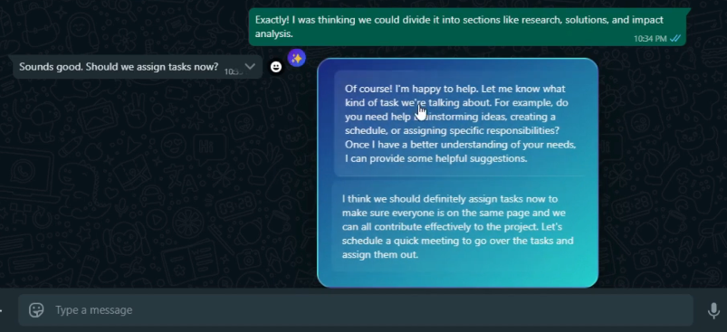

# Briefly

## What is Briefly?
Briefly is your assistant which simplifies your evey day work. It can summarize the content in any web link and shows the results when hovered.

Suggest Replies for Whatsapp/Telegram messages
 

## How to install?
To install this extension, check the Releases section on this page. Click on the latest release and dowload the .zip file. Then, unzip the folder, go to chrome://extensions, enable developer mode, click on load unpacked and select the unzipped folder. Briefly should now show up in your extensions.

This extension can work on new chrome version 127 or higher.
- go to chrome://flags/#optimization-guide-on-device-model and set it to "Enabled BypassPerfRequirement"
- enable chrome://flags/#summarization-api-for-gemini-nano, chrome://flags/#writer-api-for-gemini-nano

Now Briefly will be added to your browser.